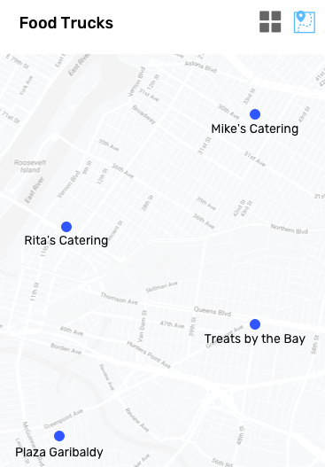

# coding-challenge

## Introduction

Below are two coding challenges, one focused on backend, the other focused on frontend.  Please complete the challenge most appropriate for the role you are applying for.

The challenges are not intended to take a significant amount of time.  If you feel like the challenges are taking more than a couple hours to complete, please feel free to reach out to us.

When you are done, please send your code to (coding-challenge@daupler.com). You are welcome to send a zipped folder or share it using Github.

## Backend Challenge: Django Service

Create a Django backend service that allows users to manage their after hours teams.  A team is a list of team members, with each team member having a role within its team.

During an emergency, the members of a team will be called one by one according to a specific order.

Here is an example of a team list provided for a customer's "Water Division" team, indicating the roles and call order:

Name | Role
--- | ---
Cooper | First Responder
Laura | Standby Responder
Leland | Standby Responder
Bob | Supervisor

### Requirements:

- Use Django to create a backend service that can store teams and team members.  You can use any library on top of Django that you like.  You may use the default SQLite database.

- Your service should have an API that allows users to perform the following actions:
  * View a list of teams, including their members
  * Create new teams
  * Add and remove team members from a team
  * Update the team call order

- Write at least one test, but no more than five.  Try to write tests that you feel provide the most value.  You do not need to write every test you would write for production-ready code.

## Frontend Challenge: Single Page Application

Create a service that tells the user what types of food trucks might be found near a specific location on a map. Data can be found here: https://data.sfgov.org/Economy-and-Community/Mobile-Food-Facility-Permit/rqzj-sfat

### Requirements:

- Use a Single Page Application, using React or Angular.

- Must have a method to switch between map and a table view listing the food trucks

- The product owners could not agree on a design, but maybe something like this:

### Hints:

To make things easier, feel free to rearrange the json output, truncate the json list, store locally, or just grab all the data from https://data.sfgov.org/resource/rqzj-sfat.json and parse locally. We are looking for general coding style, creativity, and problem solving. We realize in the real world the API would be more flexible and helpful for the task at hand.

## Alternative: Share an existing project

While we prefer you complete one of the above challenges, we understand there is not always time.  In this case we ask that you share something you have already built.

### Requirements

- Explain the problem you were trying to solve

- Share a specific piece of code that you are proud of

- Tell us about something you wish you could change about the project

- What was something you encountered during the project that was deceptively complex?
